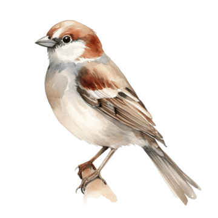

# Bird Ringing Assistant

A Qt-based desktop application for assisting bird ringing data collection.  
It features a Hungarian-language GUI for adding, editing, and managing capture data, including species and observational details.

<p align="center">
  
</p>

---

## Features

- Add, edit, and delete bird capture records
- Species dropdown menu from external file (`madarlista2.txt`)
- Automatically updates species observation frequency
- Data import and export in human-readable text format
- All labels and controls are in **Hungarian**
- Logo displayed from external file (`madarlogo.png`)

---

## Project Structure

```

.
├── main.cpp                # Application entry
├── mainwindow\.cpp/.h/.ui  # GUI logic and layout
├── madarlista2.txt         # Bird species list (Hungarian name, Latin name, code)
├── madarlogo.png           # Displayed logo
├── bird_ringing.pro        # Qt project file
├── README.md               # Project documentation

```

---

## ▶ Running the Application

1. Open `beadando.pro` in **Qt Creator**
2. Build and run the project
3. Ensure `madarlista2.txt` and `madarlogo.png` are in the working directory

---

## Input Format

`madarlista2.txt` should be in CSV format with this structure:

```

HungarianName,LatinName,Code
Feketerigó,Turdus merula,A12

```

---

## Exported Data Format

Records are saved in a semicolon-separated `.txt` file like:

```

12345;Feketerigó;2025-05-29 13:44;Siófok;E;2y;M;F;R

```

Each field corresponds to:
```

RingCode;Species;DateTime;Location;Type;Age;Sex;Status;Manipulation

```

---

## Dependencies

- Qt 5 or 6 (Widgets module)
- C++17 compatible compiler

---

## License

MIT License — free to use, modify, and distribute.

---

## Author

Created as a course project to support ornithological fieldwork.

```
